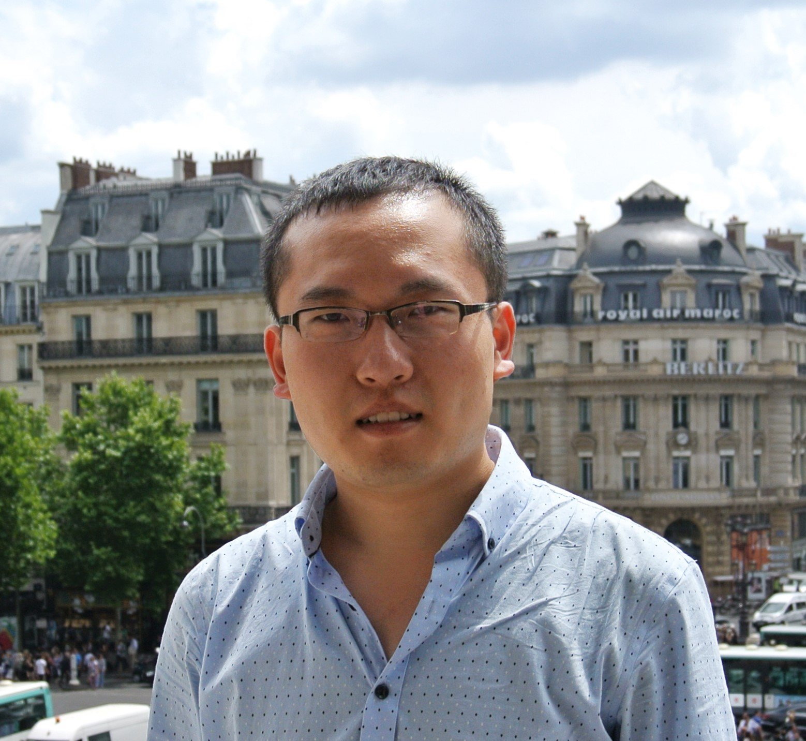

# { width=100px }  
## Andong Ma

## Contact Information
- ✉️ Email: [anma@msudenver.edu](mailto:anma@msudenver.edu)  
- 💻 GitHub: [github.com/anma-msudenver](https://github.com/anma-msudenver)  
- 🔗 LinkedIn: [linkedin.com/in/andongma](https://www.linkedin.com/in/andongma)  
- 🌐 ORCID: [0000-0003-1520-7381](https://orcid.org/0000-0003-1520-7381)

## Education
- **Ph.D. in Geography**, _University Name_, Year  
- **M.Sc. in Geospatial Sciences**, _University Name_, Year  
- **B.Sc. in Geography**, _University Name_, Year  

## Professional Experience
- **Assistant Professor**, Department of Earth & Atmospheric Sciences, Metropolitan State University of Denver (2024 – Present)  
- **Research Scientist**, [Previous Institution] (Year – Year)  
- **Teaching Assistant**, GNSS & Remote Sensing courses, [Institution] (Year – Year)  

## Biography
I am Dr. Andong Ma, an Assistant Professor in the Department of Earth & Atmospheric Sciences at Metropolitan State University of Denver. My research bridges deep learning and remote sensing, with a focus on environmental object detection (e.g., large-wood mapping in river floodplains) using frameworks like Faster R-CNN and YOLOv8. I hold a Ph.D. in Geography and have published extensively on AI-driven change detection and land-use classification. Beyond research, I am committed to mentoring the next generation of geospatial scientists, teaching courses in GNSS and remote sensing, and fostering GIS community engagement through workshops and events.
